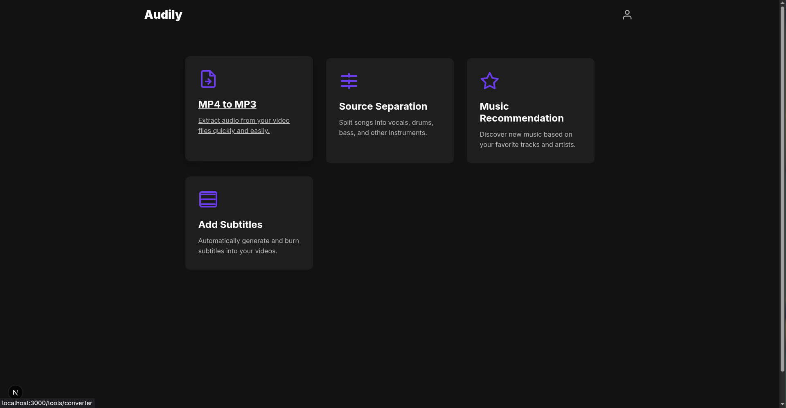
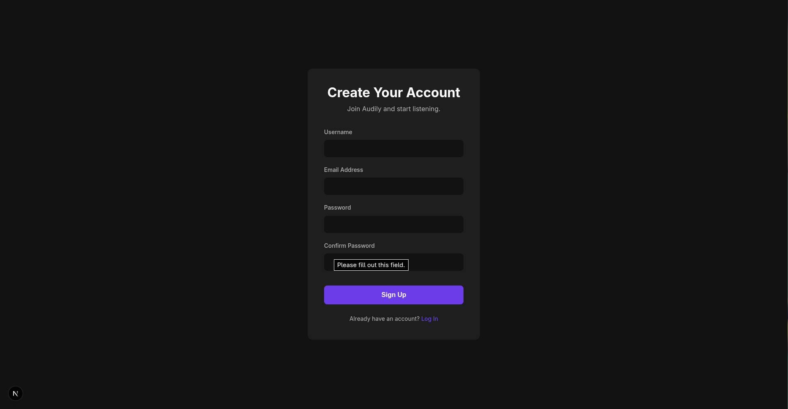
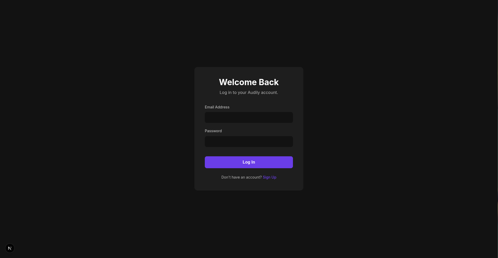
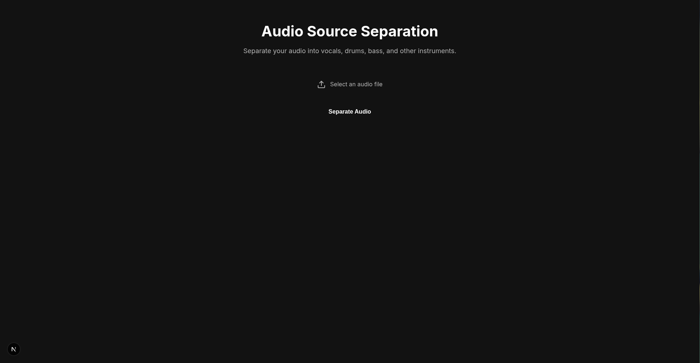
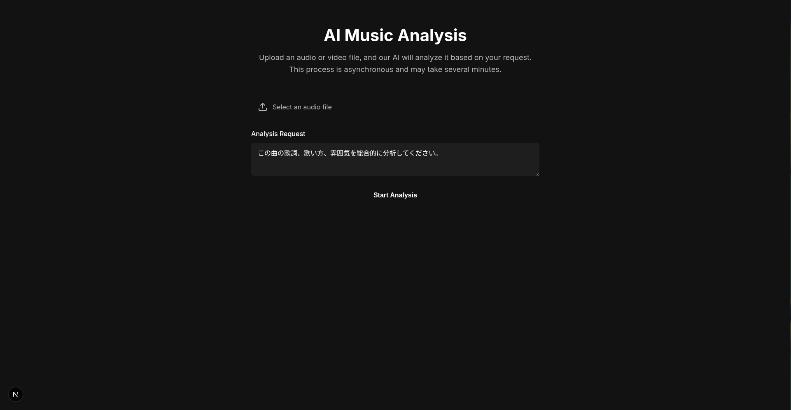
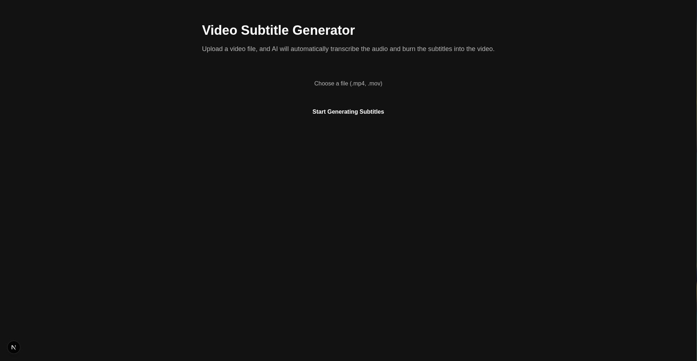
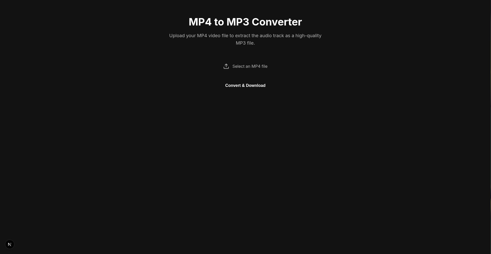
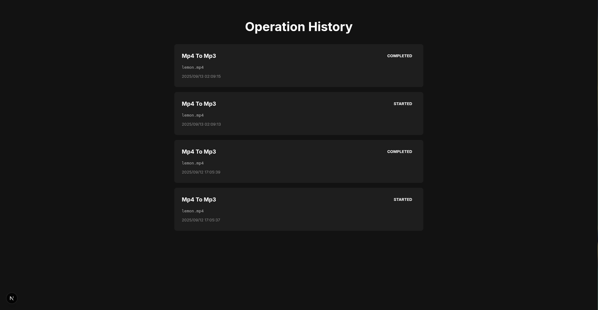

# Audily (team3)

Audilyは、音楽クリエイターや愛好家のために設計された、AIを活用した多機能な音楽処理・分析プラットフォームである。楽曲の分離から、AIによる詳細な分析、字幕生成まで、音楽に関する様々な操作を直感的なインターフェースで実現する。

## サービスの概要

#### 1. 楽曲分離 (Source Separation)
-   音源分離ライブラリ「Spleeter」を利用し、アップロードされた楽曲を自動で「ボーカル」「ピアノ」「ドラム」「ベース」「その他」の5つのパートに分離する。
-   分離された各パートは、高品質なWAVファイルとしてダウンロードでき、リミックス制作や練習に活用可能である。

#### 2. AIによる楽曲分析 (AI Music Analysis)
-   GoogleのAIモデル「Gemini」を活用し、アップロードされた楽曲やボーカルデータの特徴を深く分析する。
-   AIへの指示（プロンプト）はユーザーが自由に変更可能であり、「歌詞のテーマ性について」「ボーカルの歌唱テクニックについて」など、多角的な視点からの分析をリクエストできる。

#### 3. 字幕の自動生成 (Add Subtitles)
-   動画ファイルをアップロードすると、Geminiの強力な音声認識機能が歌詞や話し言葉をタイムスタンプ付きで正確に書き起こす。
-   生成された字幕（SRT形式）は、FFmpegによって自動的に動画に焼き付けられ、すぐに利用可能な字幕付き動画としてダウンロードされる。

#### 4. ファイル形式変換 (MP4 to MP3)
-   動画ファイル（MP4）から音声トラックのみを抽出し、高品質なMP3ファイルに変換する機能を提供する。

## プレビュー

### トップページ

### 新規登録 & ログインページ

### メニュー画面

### Source Separation（楽曲分離）

### AI Music Analysis (楽曲分析)

### Add Subtitles (字幕生成)

### MP4 to MP3 Converter (MP4からMP3への変換)

### Operation History (操作履歴)

## 使用技術

-   **使用言語:** Python, TypeScript, CSS
-   **フロントエンド:** Next.js (React)
-   **バックエンド:** FastAPI
-   **認証:** Better Auth
-   **楽曲分離:** Spleeter (by Deezer)
-   **AI / 音声認識:** Gemini API (by Google)
-   **動画・音声処理:** FFmpeg
-   **データベース:** SQLite

## 実装した機能

-   **認証機能:** メールアドレスとパスワードによる新規登録・ログイン・ログアウト機能。
-   **Source Separation:** 楽曲ファイルを5つのパートに分離し、ZIP形式でダウンロードする機能。
-   **AI Music Analysis:** 楽曲ファイルをアップロードし、AIによる分析結果を表示する非同期処理機能。
-   **Add Subtitles:** 動画ファイルから字幕を自動生成し、動画に焼き付けてダウンロードする非同期処理機能。
-   **MP4 to MP3:** 動画ファイルから音声を抽出し、MP3形式でダウンロードする機能。
-   **操作履歴:** ユーザーごとの機能利用履歴をデータベースに保存・表示する機能。

## 役割分担

### Zawa
ユーザー体験の設計、フロントエンド全体の開発、およびシステムの大部分のアーキテクチャ設計と実装を担当。

### Famous
バックエンドの各機能をクライアント側とデータ通信させるための「APIエンドポイント」の設計、実装、およびテストを担当。

## アピールポイント

-   **堅牢かつモダンな認証システム:**
    TypeScriptエコシステムのための最新認証フレームワーク「**Better Auth**」を採用した。これにより、定型的なコードを大幅に削減しつつ、安全なセッション管理とユーザー認証を迅速に実装することができた。

-   **長時間処理に対応する非同期アーキテクチャ:**
    AIによる楽曲分析や字幕生成など、完了までに数分を要する重い処理については、ユーザーを待たせることのない非同期アーキテクチャを導入した。具体的には、受付用のAPI、進捗を確認するためのポーリング用API、結果を取得するためのAPIの3つにエンドポイントを分割し、バックグラウンドでPythonの`multiprocessing`を利用して処理を実行する。これにより、ユーザーは処理中もブラウザを閉じずに他の作業をすることができ、優れたユーザー体験を提供する。

-   **責務を分離したモジュール設計:**
    バックエンドの各機能（音源分離、MP4変換、字幕生成など）は、FastAPIの`APIRouter`を用いて機能ごとにファイルを分割している。これにより、`main.py`はルーティングの管理に集中でき、各機能のロックは独立したモジュールとして管理されるため、高いメンテナンス性と拡張性を実現した。

## 改善点

-   **UI/UXの一貫性:**
    各機能ページを迅速に開発することを優先したため、ページごとにUIコンポーネントのスタイルやレイアウトに差異が生じた。今後は共通のコンポーネントライブラリを作成・利用し、アプリケーション全体で一貫したデザインシステムを適用することで、より洗練されたユーザー体験を目指すべきである。

-   **アーキテクチャの計画性:**
    開発を進める中で機能を追加していったため、初期段階でのアーキテクチャ設計が十分ではなかった。特に、バックグラウンド処理の管理や、各モジュール間の依存関係について、より計画的に設計することで、さらに堅牢でスケールしやすいシステムを構築できたと考えられる。この経験から、開発初期段階における詳細な設計の重要性を学んだ。

## 特にフィードバックが欲しいところ (任意)

-   アーキテクチャ設計をどのようにすればよいのかということ。
-   フロントエンドの状態管理（`useState`, `useEffect`）について、より複雑な状態遷移をクリーンに管理するためのアプローチ（状態管理ライブラリの導入など）についてフィードバックをいただきたい。
